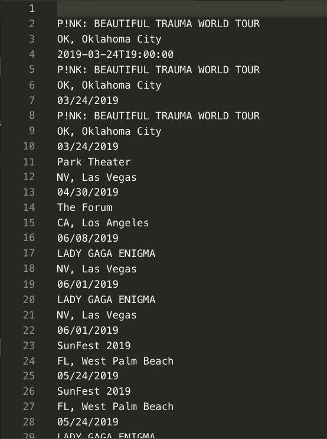

# Liri-node-app

LIRI is like iPhone's SIRI. However, while SIRI is a Speech Interpretation and Recognition Interface, LIRI is a Language Interpretation and Recognition Interface. LIRI is a command line node app that takes in parameters and gives you back data.

## Commands

*node liri.js concert-this <artist/band name here>*

This will search the Bands in Town Artist Events API and provide the Name of the venue, Venue location, Date of the Event.

## Watch video

*node liri.js spotify-this-song '<song name here>'*

This will search the following information about the song: artist(s), song's name, a preview link of the song from Spotify, the album that song is from.

## Watch video

*node liri.js movie-this '<movie name here>'*
  
This will search for the following information: title of the movie, year the movie came out, IMDB Rating of the movie, Rotten Tomatoes Rating of the movie, country where the movie was produced, language of the movie, plot of the movie, actors in the movie.

## Watch video

*node liri.js do-what-it-says*

This runs a random command that is stored on the random.txt file

## Watch video

## BONUS

The file log.txt will output a data from each command that was ran

